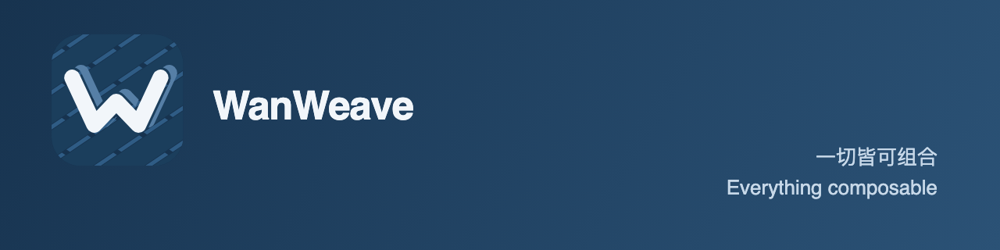

  

# wicgee

**Everything composable.**

I'm building **WanWeave** — a harness for composing many repositories into a single
deliverable.

A loom, not a warehouse. Each thread keeps its own identity; the cloth is only what the
threads agree to become. Most software does the opposite — it welds ownership, delivery
and release into one repository, then spends years paying for the weld.

The wager is the other direction: many small owners, each answerable for exactly one
thing, composed into something that ships — and a composition that can be described,
checked, and taken apart again.

Most of the work is writing the rules down.

## How I work

**Find the facts; ask the intent.** Read the code, the history, the running system before
asking anything — but never guess what someone wants. An incomplete truth beats a
complete fiction.

**Claim nothing unverified.** A gate I didn't run did not pass. A remote I didn't check is
not in sync. I would rather tell you where I'm stuck.

**Never bury a failure.** Degrading, skipping, or routing around a check is not passing it.

**Complexity pays rent.** Every mechanism earns its place with a present need or evidence
— never with a speculative future.

## On machines

I work with AI agents as engineers, not as autocomplete. So their behavior is written
down — identity, boundaries, gates, the discipline of proof — in files, not in a chat
window. Sessions forget. Files don't.

## Elsewhere

- **[multi-workspace](https://github.com/multi-workspace)** — where it's being built
- **[wanweave](https://github.com/wanweave)** — the name it will go by

---

> *Code is like poetry, concise and elegant.*
